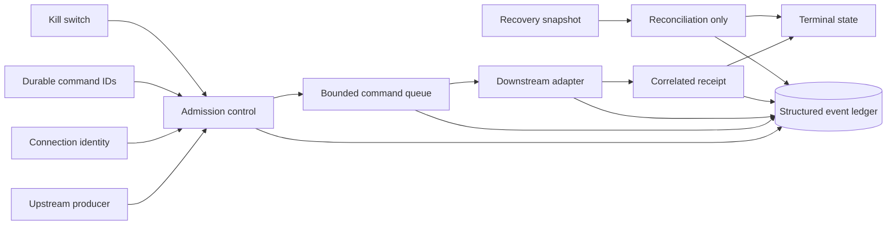
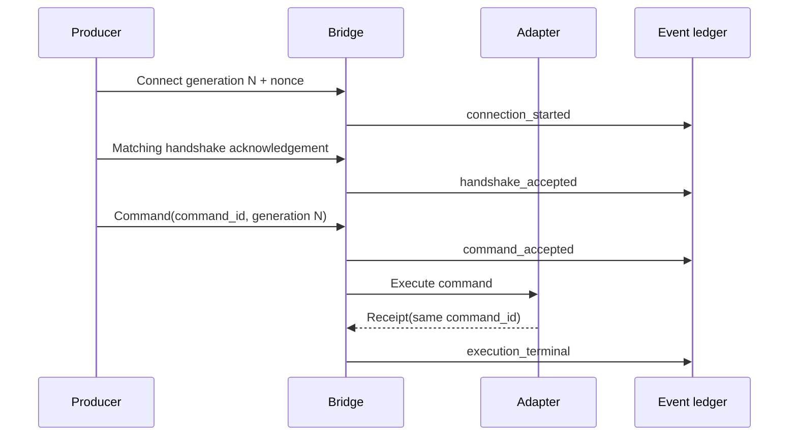

# Architecture

## Reliability contracts

| Contract | Failure prevented | Public demonstration |
| --- | --- | --- |
| Connection generation and nonce | A stale session issuing work after reconnect | Stale generations and incorrect handshake identities are rejected |
| Durable command ID | Duplicate execution after retry or replay | A repeated command is suppressed without growing the queue |
| Bounded queue | Unbounded memory growth and silent backpressure | Capacity breaches fail closed and mark the bridge degraded |
| Exact receipt correlation | Success being attributed to the wrong request | Mismatched receipt IDs cannot produce terminal success |
| Reconcile-only recovery | Recovered external state causing another execution | Snapshots update evidence without invoking the executor |
| Explicit kill switch | Unsafe admission during operator intervention | New work is rejected while the stop control is active |
| Structured event ledger | “Connected” being mistaken for “completed” | Admission, rejection, execution, and recovery remain separate events |

## State sequence

